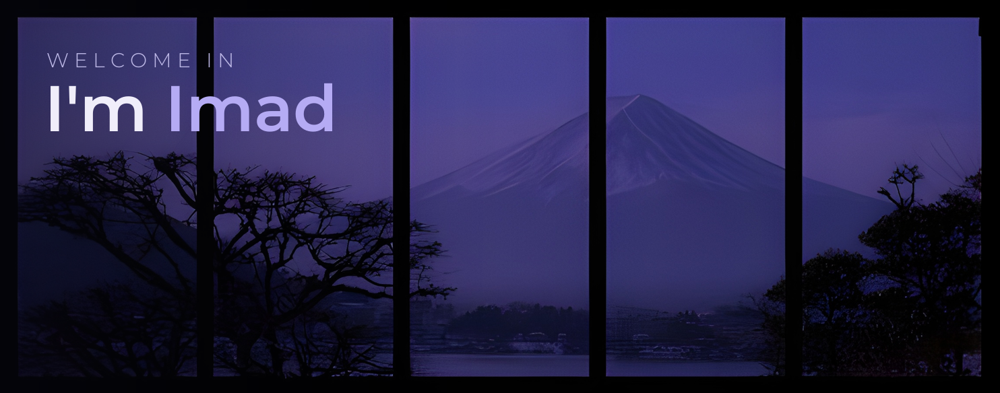

  

 

## About Me

- I'm a CS student and an aspiring Cloud Data Engineer.

- I learn by building, so most of what I know came from the open web, good advice, and shipping small real projects until they click.

- I am easily pulled toward completely new tools and clever ways to materialize everyday thoughts. I am nonetheless focused on sharpening the fundamentals.

- I like Motorsports.

 

## Tech Stack

**Languages**

**Web and Backend**

**Databases**

**Tooling**

 

## GitHub Stats

  <!---->
  
  

<!--

  

-->

 

## Projects and What's to Come

  
  &nbsp;&nbsp;&nbsp;
  

  

- **Command Line App** &nbsp; 

A keyboard first tool built for functionality, design, speed and zero friction. (More to it soon)

- **Neural Network System** &nbsp; 

Learns from data, makes its own call. Building a mini LLM to understand how the real ones work under the hood.

 

## Connect with Me

